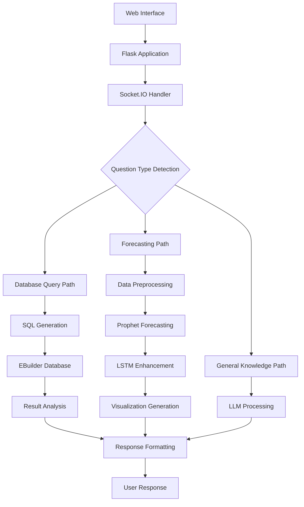

# AI Chatbot for ERP System (EBuilder) - Complete Documentation

**Version:** 1.0  
**Last Updated:** 2025-07-18  
**Author:** tate88  

## Table of Contents
1. [Overview](#overview)
2. [System Architecture](#system-architecture)
3. [Features](#features)
4. [Installation Guide](#installation-guide)
5. [Configuration](#configuration)
6. [API Reference](#api-reference)
7. [Database Schema](#database-schema)
8. [Usage Examples](#usage-examples)
9. [Troubleshooting](#troubleshooting)
10. [Maintenance](#maintenance)
11. [Security](#security)
12. [Performance](#performance)

## Overview

This AI-powered chatbot is designed to interact with an ERP system (EBuilder) to provide intelligent business insights through natural language processing. The system combines multiple AI technologies to deliver comprehensive sales analysis, forecasting, and business intelligence capabilities.

### Key Capabilities
- **Natural Language Processing**: Convert business questions into actionable database queries
- **Advanced Forecasting**: Hybrid Prophet + LSTM neural network predictions
- **Real-time Analysis**: Instant insights from ERP data
- **Business Intelligence**: Automated trend detection and recommendations
- **Product Performance**: Specialized analysis for new and existing products

### Technology Stack
- **Backend**: Python Flask with Socket.IO
- **Database**: SQL Server (EBuilder ERP)
- **AI/ML**: OpenRouter API, Prophet, TensorFlow/Keras
- **Frontend**: Web-based interface with real-time communication
- **Visualization**: Matplotlib for forecast charts

## System Architecture



### Core Components

#### 1. Flask Application Server
- **Purpose**: Main web server handling HTTP requests and responses
- **Key Files**: `app.py`, `routes.py`
- **Responsibilities**: Request routing, session management, API endpoints

#### 2. Socket.IO Communication Layer
- **Purpose**: Real-time bidirectional communication
- **Implementation**: WebSocket fallback support
- **Benefits**: Instant responses, typing indicators, connection status

#### 3. Database Connectivity Module
- **Driver**: PyODBC with SQL Server
- **Connection**: ODBC Driver 17 for SQL Server
- **Features**: Connection pooling, automatic reconnection, query optimization

#### 4. AI Processing Engine
- **NLP**: OpenRouter API for multiple LLM access
- **Forecasting**: Prophet + LSTM hybrid approach
- **Analysis**: Automated insight generation

## Features

### 1. Natural Language to SQL Conversion

#### How It Works
1. **Question Analysis**: LLM analyzes user intent and required data
2. **Schema Mapping**: Automatic mapping to EBuilder database schema
3. **SQL Generation**: Optimized query creation with proper joins
4. **Execution**: Safe query execution with result validation
5. **Analysis**: Intelligent interpretation of results

#### Supported Query Types
- Sales performance by period, product, or region
- Customer analysis and segmentation
- Inventory status and trends
- Financial metrics and KPIs
- Comparative analysis across time periods

### 2. Hybrid Forecasting System

#### Prophet Component
- **Strengths**: Handles seasonality, holidays, trend changes
- **Data Requirements**: Minimum 30 data points for reliable forecasts
- **Outputs**: Trend, seasonal components, uncertainty intervals

#### LSTM Neural Network Component
- **Purpose**: Captures complex non-linear patterns in residuals
- **Architecture**: Multi-layer LSTM with dropout regularization
- **Training**: Automatic hyperparameter optimization
- **Integration**: Applied to Prophet residuals for enhanced accuracy

#### Forecast Types
- **General Sales Forecasting**: Overall revenue and volume predictions
- **Product-Specific Forecasting**: Individual SKU performance
- **New Product Forecasting**: Using reference product patterns
- **Seasonal Forecasting**: Holiday and seasonal adjustments

### 3. Intelligent Business Analysis

#### Automatic Insights
- **Trend Detection**: Identifies growth, decline, or stability patterns
- **Anomaly Detection**: Highlights unusual data points
- **Seasonality Analysis**: Identifies recurring patterns
- **Performance Comparison**: Benchmarks against historical data

#### Recommendations Engine
- **Inventory Management**: Stock level optimization suggestions
- **Marketing Timing**: Optimal promotion scheduling
- **Resource Allocation**: Sales team and budget recommendations
- **Risk Assessment**: Identifies potential issues and opportunities

### 4. Specialized Product Analysis

#### New Product Launch Support
- **Reference Product Matching**: Finds similar existing products
- **First 6-Month Analysis**: Detailed launch performance tracking
- **Market Entry Timing**: Optimal launch window recommendations
- **Performance Benchmarking**: Comparison with successful launches

#### Product Lifecycle Management
- **Growth Stage Identification**: Automatic classification
- **Decline Detection**: Early warning systems
- **Portfolio Optimization**: Product mix recommendations
- **Cannibalization Analysis**: Impact of new products on existing ones

## Installation Guide

### Prerequisites

#### System Requirements
- **Operating System**: Windows Server 2016+ or Linux
- **Python**: Version 3.8 or higher
- **Memory**: Minimum 8GB RAM (16GB recommended)
- **Storage**: 50GB free space for models and data
- **Network**: Stable internet connection for API access

#### Database Requirements
- **SQL Server**: 2017 or higher
- **EBuilder ERP**: Compatible version
- **ODBC Driver**: Version 17 for SQL Server
- **Permissions**: Read access to ERP tables, write access for logs

### Step-by-Step Installation

#### 1. Environment Setup
```bash
# Create virtual environment
python -m venv erp_chatbot_env

# Activate environment (Windows)
erp_chatbot_env\Scripts\activate

# Activate environment (Linux/Mac)
source erp_chatbot_env/bin/activate
```

#### 2. Package Installation
```bash
# Core dependencies
pip install flask==2.3.3
pip install flask-socketio==5.3.6
pip install pyodbc==4.0.39
pip install pandas==2.0.3
pip install numpy==1.24.3

# AI/ML packages
pip install prophet==1.1.4
pip install tensorflow==2.13.0
pip install scikit-learn==1.3.0
pip install matplotlib==3.7.2
pip install plotly==5.15.0

# Additional utilities
pip install python-dotenv==1.0.0
pip install requests==2.31.0
pip install cryptography==41.0.3
```

#### 3. Database Configuration
```sql
-- Create application user (run as DBA)
CREATE LOGIN erp_chatbot_user WITH PASSWORD = 'SecurePassword123!';
USE EBuilder;
CREATE USER erp_chatbot_user FOR LOGIN erp_chatbot_user;

-- Grant necessary permissions
GRANT SELECT ON SCHEMA::dbo TO erp_chatbot_user;
GRANT EXECUTE ON SCHEMA::dbo TO erp_chatbot_user;
```

#### 4. Application Configuration
Create `.env` file:
```env
# Database Configuration
DB_SERVER=your_server_name
DB_DATABASE=EBuilder
DB_USERNAME=erp_chatbot_user
DB_PASSWORD=SecurePassword123!
DB_DRIVER=ODBC Driver 17 for SQL Server

# API Configuration
OPENROUTER_API_KEY=your_openrouter_api_key
DEFAULT_MODEL=anthropic/claude-3-haiku

# Application Settings
FLASK_ENV=production
SECRET_KEY=your_secret_key_here
LOG_LEVEL=INFO
MAX_FORECAST_DAYS=365
```

## Configuration

### Environment Variables

| Variable | Description | Default | Required |
|----------|-------------|---------|----------|
| `DB_SERVER` | SQL Server instance name | localhost | Yes |
| `DB_DATABASE` | EBuilder database name | EBuilder | Yes |
| `DB_USERNAME` | Database username | - | Yes |
| `DB_PASSWORD` | Database password | - | Yes |
| `OPENROUTER_API_KEY` | OpenRouter API key | - | Yes |
| `DEFAULT_MODEL` | Default LLM model | claude-3-haiku | No |
| `MAX_FORECAST_DAYS` | Maximum forecast period | 365 | No |
| `LOG_LEVEL` | Logging level | INFO | No |

### Model Configuration

#### Prophet Settings
```python
PROPHET_CONFIG = {
    'seasonality_mode': 'multiplicative',
    'yearly_seasonality': True,
    'weekly_seasonality': True,
    'daily_seasonality': False,
    'changepoint_prior_scale': 0.05,
    'seasonality_prior_scale': 10.0
}
```

#### LSTM Settings
```python
LSTM_CONFIG = {
    'sequence_length': 30,
    'hidden_units': 50,
    'dropout_rate': 0.2,
    'epochs': 100,
    'batch_size': 32,
    'validation_split': 0.2
}
```

## API Reference

### Core Functions

#### Database Operations

##### `get_database_schema()`
Retrieves the complete database schema for query generation.

**Returns:**
- `dict`: Schema information including tables, columns, and relationships

**Example:**
```python
schema = get_database_schema()
print(schema['tables']['sales']['columns'])
```

##### `extract_query_details_from_llm(question, schema)`
Converts natural language questions to SQL queries.

**Parameters:**
- `question` (str): User's natural language question
- `schema` (dict): Database schema information

**Returns:**
- `dict`: SQL query and metadata

**Example:**
```python
result = extract_query_details_from_llm(
    "What were the top 5 products by sales last month?",
    schema
)
```

#### Forecasting Operations

##### `is_forecast_question(question)`
Determines if a question requires forecasting analysis.

**Parameters:**
- `question` (str): User's question

**Returns:**
- `bool`: True if forecasting is needed

##### `hybrid_forecast(data, forecast_days, product_name=None)`
Performs hybrid Prophet + LSTM forecasting.

**Parameters:**
- `data` (DataFrame): Historical data with 'ds' and 'y' columns
- `forecast_days` (int): Number of days to forecast
- `product_name` (str, optional): Product identifier

**Returns:**
- `dict`: Forecast results, plots, and analysis

#### Analysis Functions

##### `generate_llm_response(question, context=None)`
Generates natural language responses using LLM.

**Parameters:**
- `question` (str): User's question
- `context` (str, optional): Additional context

**Returns:**
- `str`: Generated response

##### `get_llm_table_analysis(query_result, question)`
Analyzes query results and provides insights.

**Parameters:**
- `query_result` (list): Database query results
- `question` (str): Original question

**Returns:**
- `str`: Analysis and insights

### WebSocket Events

#### Client to Server Events

##### `user_message`
Sends user message to the server.

**Payload:**
```json
{
    "message": "What were our sales last quarter?",
    "session_id": "unique_session_id"
}
```

##### `get_forecast`
Requests forecast analysis.

**Payload:**
```json
{
    "product": "Product Name",
    "days": 30,
    "session_id": "unique_session_id"
}
```

#### Server to Client Events

##### `bot_response`
Sends bot response to client.

**Payload:**
```json
{
    "message": "Analysis results here...",
    "type": "text",
    "timestamp": "2025-07-18T01:50:28Z"
}
```

##### `forecast_result`
Sends forecast results with visualization.

**Payload:**
```json
{
    "forecast_data": {...},
    "plot_url": "/static/plots/forecast_123.png",
    "summary": "Forecast analysis summary",
    "type": "forecast"
}
```

## Database Schema

### Key EBuilder Tables

#### Sales Transactions
```sql
CREATE TABLE sales_transactions (
    transaction_id INT PRIMARY KEY,
    product_id INT,
    customer_id INT,
    transaction_date DATE,
    quantity DECIMAL(10,2),
    unit_price DECIMAL(10,2),
    total_amount DECIMAL(10,2),
    sales_rep_id INT
);
```

#### Products
```sql
CREATE TABLE products (
    product_id INT PRIMARY KEY,
    product_name VARCHAR(255),
    category_id INT,
    unit_cost DECIMAL(10,2),
    launch_date DATE,
    status VARCHAR(50)
);
```

#### Customers
```sql
CREATE TABLE customers (
    customer_id INT PRIMARY KEY,
    customer_name VARCHAR(255),
    region VARCHAR(100),
    customer_type VARCHAR(50),
    registration_date DATE
);
```

### Required Views for Forecasting

#### Daily Sales Summary
```sql
CREATE VIEW daily_sales_summary AS
SELECT 
    CAST(transaction_date AS DATE) as ds,
    SUM(total_amount) as y,
    COUNT(*) as transaction_count
FROM sales_transactions
GROUP BY CAST(transaction_date AS DATE);
```

#### Product Sales Summary
```sql
CREATE VIEW product_sales_summary AS
SELECT 
    p.product_name,
    CAST(st.transaction_date AS DATE) as ds,
    SUM(st.total_amount) as y,
    SUM(st.quantity) as quantity
FROM sales_transactions st
JOIN products p ON st.product_id = p.product_id
GROUP BY p.product_name, CAST(st.transaction_date AS DATE);
```

## Usage Examples

### Basic Sales Query
```python
# User question: "What were our total sales last month?"
# System generates and executes:
SELECT SUM(total_amount) as total_sales
FROM sales_transactions 
WHERE transaction_date >= DATEADD(month, -1, GETDATE())
  AND transaction_date < GETDATE();
```

### Product Forecasting
```python
# User question: "Forecast sales for Product ABC for next 30 days"
product_data = fetch_product_forecast_data("Product ABC")
forecast_result = hybrid_forecast(
    data=product_data,
    forecast_days=30,
    product_name="Product ABC"
)
```

### Customer Analysis
```python
# User question: "Which customers bought the most last quarter?"
# Generated SQL with automatic date calculation and ranking
SELECT TOP 10 
    c.customer_name,
    SUM(st.total_amount) as total_purchases,
    COUNT(st.transaction_id) as transaction_count
FROM customers c
JOIN sales_transactions st ON c.customer_id = st.customer_id
WHERE st.transaction_date >= DATEADD(quarter, -1, GETDATE())
GROUP BY c.customer_name
ORDER BY total_purchases DESC;
```

## Troubleshooting

### Common Issues and Solutions

#### Database Connection Issues

**Problem**: "ODBC Driver not found"
**Solution**: 
```bash
# Download and install ODBC Driver 17
# Windows: Download from Microsoft official site
# Linux: 
curl https://packages.microsoft.com/keys/microsoft.asc | apt-key add -
curl https://packages.microsoft.com/config/ubuntu/20.04/prod.list > /etc/apt/sources.list.d/mssql-release.list
apt-get update
ACCEPT_EULA=Y apt-get install -y msodbcsql17
```

**Problem**: "Login failed for user"
**Solution**: Verify credentials and permissions:
```sql
-- Check user permissions
SELECT 
    dp.permission_name,
    dp.state_desc,
    o.name AS object_name
FROM sys.database_permissions dp
JOIN sys.objects o ON dp.major_id = o.object_id
WHERE dp.grantee_principal_id = USER_ID('erp_chatbot_user');
```

#### Forecasting Issues

**Problem**: "Insufficient data for forecasting"
**Solution**: 
- Ensure minimum 30 data points
- Check data quality and completeness
- Verify date column format

**Problem**: "LSTM training fails"
**Solution**:
```python
# Check data preprocessing
import pandas as pd
import numpy as np

def validate_forecast_data(data):
    """Validate data before forecasting"""
    if len(data) < 30:
        raise ValueError("Insufficient data: need at least 30 points")
    
    if data['y'].isna().sum() > 0:
        print(f"Warning: {data['y'].isna().sum()} missing values found")
        data['y'] = data['y'].fillna(method='forward')
    
    return data
```

#### API Issues

**Problem**: "OpenRouter API quota exceeded"
**Solution**: 
- Check API usage limits
- Implement request caching
- Use fallback models

#### Performance Issues

**Problem**: "Slow query execution"
**Solution**:
```sql
-- Add indexes for common queries
CREATE INDEX IX_sales_transactions_date 
ON sales_transactions(transaction_date);

CREATE INDEX IX_sales_transactions_product 
ON sales_transactions(product_id, transaction_date);
```

### Debugging Tools

#### Enable Debug Logging
```python
import logging
logging.basicConfig(
    level=logging.DEBUG,
    format='%(asctime)s - %(name)s - %(levelname)s - %(message)s',
    handlers=[
        logging.FileHandler('erp_chatbot.log'),
        logging.StreamHandler()
    ]
)
```

#### Query Performance Monitoring
```python
import time
import pyodbc

def execute_query_with_timing(query):
    start_time = time.time()
    try:
        result = cursor.execute(query).fetchall()
        execution_time = time.time() - start_time
        print(f"Query executed in {execution_time:.2f} seconds")
        return result
    except Exception as e:
        print(f"Query failed: {e}")
        return None
```

## Maintenance

### Regular Maintenance Tasks

#### Daily Tasks
- Monitor application logs for errors
- Check database connection health
- Verify API quota usage
- Review forecast accuracy metrics

#### Weekly Tasks
- Analyze query performance trends
- Update model performance metrics
- Clean temporary forecast files
- Review user feedback and issues

#### Monthly Tasks
- Retrain LSTM models with new data
- Update database schema mappings
- Performance optimization review
- Security audit and updates

### Model Retraining

#### Automatic Retraining Schedule
```python
# Schedule weekly model updates
def schedule_model_retraining():
    """Schedule automatic model retraining"""
    import schedule
    import time
    
    schedule.every().sunday.at("02:00").do(retrain_models)
    
    while True:
        schedule.run_pending()
        time.sleep(3600)  # Check every hour
```

#### Manual Retraining Process
```python
def retrain_models(product_id=None):
    """Manually retrain models for specific products"""
    if product_id:
        # Retrain specific product model
        data = fetch_product_forecast_data(product_id)
        model = train_lstm_model(data)
        save_model(model, f"lstm_model_{product_id}")
    else:
        # Retrain all models
        products = get_all_products()
        for product in products:
            retrain_models(product['id'])
```

### Backup and Recovery

#### Database Backup
```sql
-- Create regular backups of model metadata
BACKUP DATABASE EBuilder_ChatBot_Metadata 
TO DISK = 'C:\Backups\EBuilder_ChatBot_Metadata.bak'
WITH FORMAT, COMPRESSION;
```

#### Model Backup
```python
import shutil
import datetime

def backup_models():
    """Create backup of trained models"""
    backup_dir = f"backups/models_{datetime.date.today()}"
    shutil.copytree("models/", backup_dir)
    print(f"Models backed up to {backup_dir}")
```

## Security

### Authentication and Authorization

#### API Key Management
```python
import os
from cryptography.fernet import Fernet

def encrypt_api_key(api_key):
    """Encrypt API keys for secure storage"""
    key = Fernet.generate_key()
    f = Fernet(key)
    encrypted_key = f.encrypt(api_key.encode())
    return encrypted_key, key

def decrypt_api_key(encrypted_key, key):
    """Decrypt API keys for use"""
    f = Fernet(key)
    decrypted_key = f.decrypt(encrypted_key)
    return decrypted_key.decode()
```

#### SQL Injection Prevention
```python
def safe_query_execution(query, params=None):
    """Execute queries with parameterization"""
    try:
        if params:
            cursor.execute(query, params)
        else:
            # Validate query before execution
            if validate_sql_query(query):
                cursor.execute(query)
            else:
                raise ValueError("Invalid SQL query detected")
        return cursor.fetchall()
    except Exception as e:
        logging.error(f"Query execution failed: {e}")
        return None
```

#### Data Access Control
```python
def check_user_permissions(user_id, requested_data):
    """Check if user has permission to access requested data"""
    user_permissions = get_user_permissions(user_id)
    
    if 'admin' in user_permissions:
        return True
    elif 'sales_data' in user_permissions and 'sales' in requested_data:
        return True
    elif 'product_data' in user_permissions and 'product' in requested_data:
        return True
    else:
        return False
```

### Data Privacy

#### Sensitive Data Handling
```python
def anonymize_customer_data(data):
    """Remove or hash sensitive customer information"""
    import hashlib
    
    if 'customer_id' in data.columns:
        data['customer_id'] = data['customer_id'].apply(
            lambda x: hashlib.sha256(str(x).encode()).hexdigest()[:8]
        )
    
    # Remove personally identifiable information
    sensitive_columns = ['email', 'phone', 'address']
    for col in sensitive_columns:
        if col in data.columns:
            data = data.drop(columns=[col])
    
    return data
```

#### Audit Logging
```python
def log_user_activity(user_id, action, data_accessed):
    """Log all user activities for audit purposes"""
    audit_entry = {
        'user_id': user_id,
        'timestamp': datetime.datetime.utcnow(),
        'action': action,
        'data_accessed': data_accessed,
        'ip_address': request.remote_addr
    }
    
    # Store in audit log database
    insert_audit_log(audit_entry)
```

## Performance

### Optimization Strategies

#### Query Optimization
```python
def optimize_query_performance():
    """Implement query performance optimizations"""
    
    # Cache frequently used queries
    query_cache = {}
    
    def cached_query(query, cache_duration=300):
        """Cache query results for specified duration"""
        import time
        current_time = time.time()
        
        if query in query_cache:
            cached_result, timestamp = query_cache[query]
            if current_time - timestamp < cache_duration:
                return cached_result
        
        # Execute query and cache result
        result = execute_query(query)
        query_cache[query] = (result, current_time)
        return result
```

#### Memory Management
```python
def manage_memory_usage():
    """Monitor and manage memory usage"""
    import psutil
    import gc
    
    # Monitor memory usage
    memory_percent = psutil.virtual_memory().percent
    
    if memory_percent > 80:
        # Clear model cache
        clear_model_cache()
        
        # Force garbage collection
        gc.collect()
        
        # Log memory warning
        logging.warning(f"High memory usage: {memory_percent}%")
```

#### Forecast Caching
```python
def cache_forecast_results(product_id, forecast_data, duration_hours=24):
    """Cache forecast results to improve response time"""
    import json
    import time
    
    cache_key = f"forecast_{product_id}"
    cache_data = {
        'forecast': forecast_data,
        'timestamp': time.time(),
        'duration': duration_hours * 3600
    }
    
    # Store in Redis or file cache
    with open(f"cache/{cache_key}.json", 'w') as f:
        json.dump(cache_data, f)
```

### Monitoring and Metrics

#### Performance Metrics
```python
def collect_performance_metrics():
    """Collect and analyze performance metrics"""
    metrics = {
        'query_response_time': [],
        'forecast_generation_time': [],
        'api_response_time': [],
        'memory_usage': [],
        'database_connections': []
    }
    
    # Implement metric collection
    return metrics
```

#### Health Checks
```python
def health_check():
    """Perform system health checks"""
    health_status = {
        'database': check_database_connection(),
        'api': check_api_connectivity(),
        'models': check_model_availability(),
        'disk_space': check_disk_space(),
        'memory': check_memory_usage()
    }
    
    return health_status
```

---

## Appendix

### A. Configuration Templates

#### Production Configuration
```python
# config/production.py
import os

class ProductionConfig:
    SECRET_KEY = os.environ.get('SECRET_KEY')
    DATABASE_URL = os.environ.get('DATABASE_URL')
    OPENROUTER_API_KEY = os.environ.get('OPENROUTER_API_KEY')
    
    # Performance settings
    SQLALCHEMY_POOL_SIZE = 20
    SQLALCHEMY_POOL_TIMEOUT = 30
    SQLALCHEMY_POOL_RECYCLE = 3600
    
    # Caching
    CACHE_TYPE = 'redis'
    CACHE_REDIS_URL = os.environ.get('REDIS_URL')
    
    # Logging
    LOG_LEVEL = 'INFO'
    LOG_FILE = '/var/log/erp_chatbot/app.log'
```

### B. Sample Queries

#### Complex Sales Analysis
```sql
-- Monthly sales trend with year-over-year comparison
WITH monthly_sales AS (
    SELECT 
        YEAR(transaction_date) as year,
        MONTH(transaction_date) as month,
        SUM(total_amount) as total_sales,
        COUNT(*) as transaction_count
    FROM sales_transactions
    WHERE transaction_date >= DATEADD(year, -2, GETDATE())
    GROUP BY YEAR(transaction_date), MONTH(transaction_date)
),
sales_with_previous_year AS (
    SELECT 
        year,
        month,
        total_sales,
        transaction_count,
        LAG(total_sales, 12) OVER (ORDER BY year, month) as previous_year_sales
    FROM monthly_sales
)
SELECT 
    year,
    month,
    total_sales,
    previous_year_sales,
    CASE 
        WHEN previous_year_sales > 0 
        THEN ((total_sales - previous_year_sales) / previous_year_sales) * 100
        ELSE NULL 
    END as yoy_growth_percentage
FROM sales_with_previous_year
ORDER BY year, month;
```

### C. Error Codes

| Code | Description | Resolution |
|------|-------------|------------|
| DB001 | Database connection failed | Check connection string and credentials |
| DB002 | Query timeout | Optimize query or increase timeout |
| API001 | API key invalid | Verify OpenRouter API key |
| API002 | API rate limit exceeded | Implement backoff strategy |
| FC001 | Insufficient forecast data | Ensure minimum 30 data points |
| FC002 | LSTM training failed | Check data quality and parameters |

### D. Support Information

For technical support and questions:
- **Documentation**: This document
- **Issue Tracking**: GitHub Issues
- **Contact**: tate88
- **Last Updated**: 2025-07-18 01:50:28 UTC

---

*This documentation is maintained by the development team and updated regularly. Please refer to the latest version for current information.*