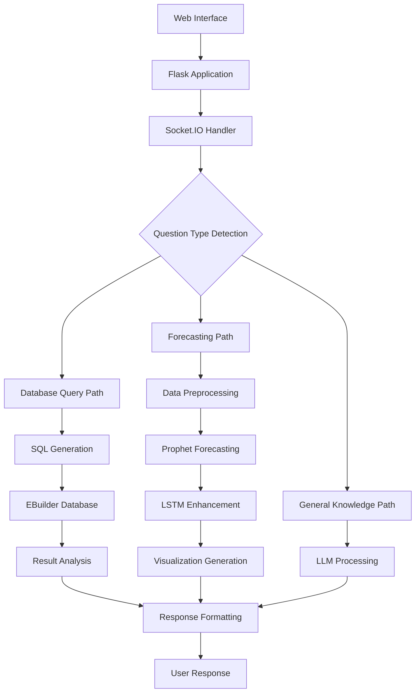

# AI Chatbot for ERP System (EBuilder) - Complete Documentation

**Version:** 1.0  
**Last Updated:** 2025-07-18 02:25:07  
**Author:** tate88  

## Table of Contents
1. [Overview](#overview)
2. [System Architecture](#system-architecture)
3. [Features](#features)

## Overview

This AI-powered chatbot is designed to interact with an ERP system (EBuilder) to provide intelligent business insights through natural language processing. The system combines multiple AI technologies to deliver comprehensive sales analysis, forecasting, and business intelligence capabilities.

### Key Capabilities
- **Natural Language Processing**: Convert business questions into actionable database queries
- **Advanced Forecasting**: Hybrid Prophet + LSTM neural network predictions
- **Real-time Analysis**: Instant insights from ERP data
- **Business Intelligence**: Automated trend detection and recommendations
- **Product Performance**: Specialized analysis for new and existing products

### Technology Stack
- **Backend**: Python Flask with Socket.IO
- **Database**: SQL Server (EBuilder ERP)
- **AI/ML**: OpenRouter API, Prophet, TensorFlow/Keras
- **Frontend**: Web-based interface with real-time communication
- **Visualization**: Matplotlib for forecast charts

## System Architecture

### Core Components

#### 1. Flask Application Server
- **Purpose**: Main web server handling HTTP requests and responses
- **Key Files**: `app.py`, `routes.py`
- **Responsibilities**: Request routing, session management, API endpoints

#### 2. Socket.IO Communication Layer
- **Purpose**: Real-time bidirectional communication
- **Implementation**: WebSocket fallback support
- **Benefits**: Instant responses, typing indicators, connection status

#### 3. Database Connectivity Module
- **Driver**: PyODBC with SQL Server
- **Connection**: ODBC Driver 17 for SQL Server
- **Features**: Connection pooling, automatic reconnection, query optimization

#### 4. AI Processing Engine
- **NLP**: OpenRouter API for multiple LLM access
- **Forecasting**: Prophet + LSTM hybrid approach
- **Analysis**: Automated insight generation

## Features

### 1. Natural Language to SQL Conversion

#### How It Works
1. **Question Analysis**: LLM analyzes user intent and required data
2. **Schema Mapping**: Automatic mapping to EBuilder database schema
3. **SQL Generation**: Optimized query creation with proper joins
4. **Execution**: Safe query execution with result validation
5. **Analysis**: Intelligent interpretation of results

#### Supported Query Types
- Sales performance by period, product, or region
- Customer analysis and segmentation
- Inventory status and trends
- Financial metrics and KPIs
- Comparative analysis across time periods

### 2. Hybrid Forecasting System

#### Prophet Component
- **Strengths**: Handles seasonality, holidays, trend changes
- **Data Requirements**: Minimum 30 data points for reliable forecasts
- **Outputs**: Trend, seasonal components, uncertainty intervals

#### LSTM Neural Network Component
- **Purpose**: Captures complex non-linear patterns in residuals
- **Architecture**: Multi-layer LSTM with dropout regularization
- **Training**: Automatic hyperparameter optimization
- **Integration**: Applied to Prophet residuals for enhanced accuracy

#### Forecast Types
- **General Sales Forecasting**: Overall revenue and volume predictions
- **Product-Specific Forecasting**: Individual SKU performance
- **New Product Forecasting**: Using reference product patterns
- **Seasonal Forecasting**: Holiday and seasonal adjustments

### 3. Intelligent Business Analysis

#### Automatic Insights
- **Trend Detection**: Identifies growth, decline, or stability patterns
- **Anomaly Detection**: Highlights unusual data points
- **Seasonality Analysis**: Identifies recurring patterns
- **Performance Comparison**: Benchmarks against historical data

#### Recommendations Engine
- **Inventory Management**: Stock level optimization suggestions
- **Marketing Timing**: Optimal promotion scheduling
- **Resource Allocation**: Sales team and budget recommendations
- **Risk Assessment**: Identifies potential issues and opportunities

### 4. Specialized Product Analysis

#### New Product Launch Support
- **Reference Product Matching**: Finds similar existing products
- **First 6-Month Analysis**: Detailed launch performance tracking
- **Market Entry Timing**: Optimal launch window recommendations
- **Performance Benchmarking**: Comparison with successful launches

#### Product Lifecycle Management
- **Growth Stage Identification**: Automatic classification
- **Decline Detection**: Early warning systems
- **Portfolio Optimization**: Product mix recommendations
- **Cannibalization Analysis**: Impact of new products on existing ones